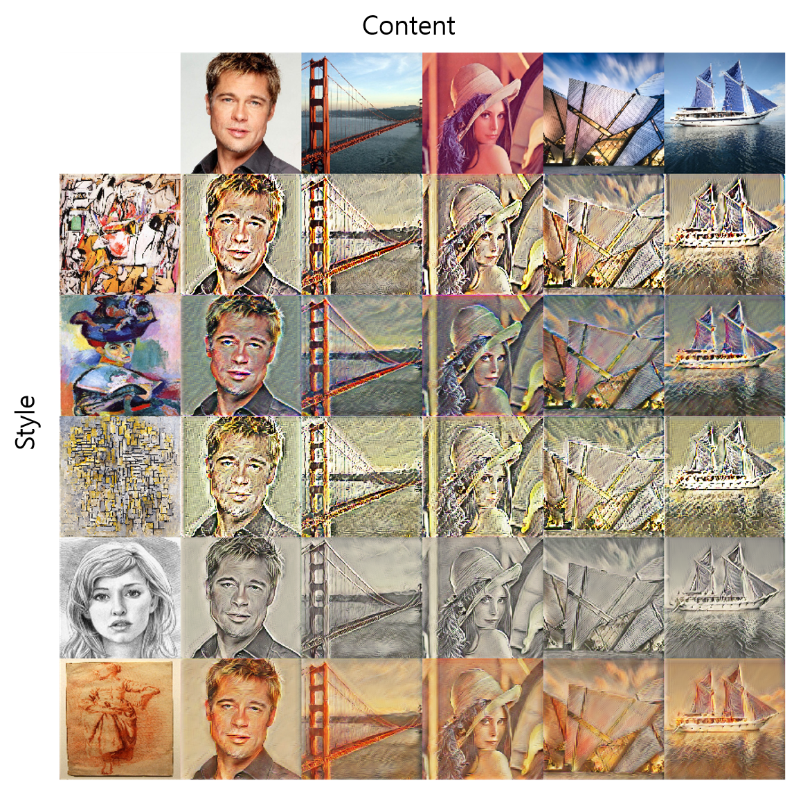

# StyleTransfer
Implementation of style transfer algorithms using tensorflow 1.x

## DataSets

Content Dataset: [MS COCO 2017](http://cocodataset.org/#home)

Style Dataset: [WikiArt]([https://github.com/cs-chan/ArtGAN/tree/master/WikiArt%20Dataset](https://github.com/cs-chan/ArtGAN/tree/master/WikiArt Dataset))

## Implemented Algorithms

1. [Arbitrary Style Transfer in Real-time with Adaptive Instance Normalization (AdaIN)](https://arxiv.org/abs/1703.06868)

## Implementation Results

### 1. Arbitrary Style Transfer in Real-time with Adaptive Instance Normalization (AdaIN)

