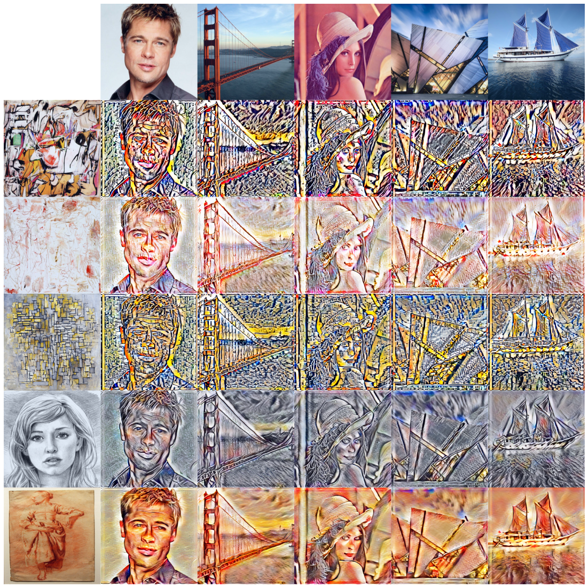

# StyleTransfer
Implementation of style transfer algorithms using tensorflow 1.x and Pytorch

## DataSets

Content Dataset: [MS COCO 2017](http://cocodataset.org/#home)

Style Dataset: [WikiArt](https://github.com/cs-chan/ArtGAN/tree/master/WikiArt%20Dataset)

## Models

- VGG19 for Pytorch: https://www.dropbox.com/s/n31xz6ee7pmeaij/vgg19-dcbb9e9d.pth?dl=0

## Implemented Algorithms

1. [Arbitrary Style Transfer in Real-time with Adaptive Instance Normalization (AdaIN)](https://arxiv.org/abs/1703.06868)

## Implementation Results

### 1. Arbitrary Style Transfer in Real-time with Adaptive Instance Normalization (AdaIN)

### Tensorflow

### Pytorch

## Reference

- VGG: https://github.com/jiweibo/ImageNet
- AdaIN: https://github.com/ftokarev/tf-adain